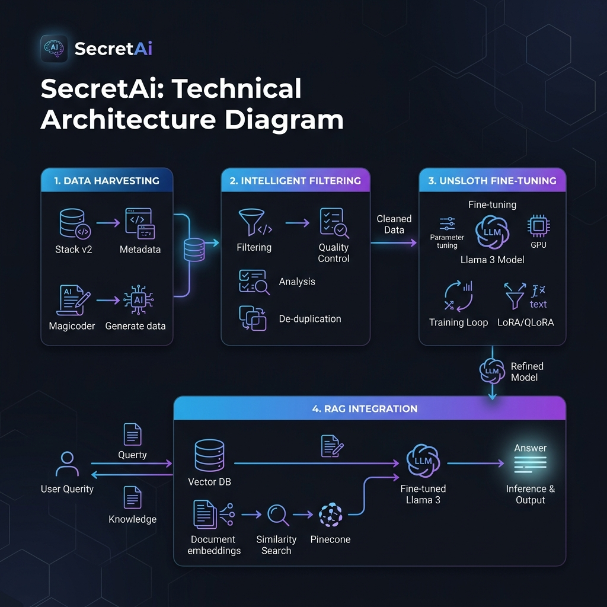

# SecretAi: Advanced Coding Assistant Pipeline

SecretAi is a specialized machine learning project focused on creating high-performance coding assistants through a hybrid data harvesting and fine-tuning pipeline. It leverages state-of-the-art techniques like **Unsloth** for optimized training and a custom filtering mechanism for high-quality dataset synthesis.



## 🚀 Overview

The primary goal of SecretAi is to transform base LLMs (like Llama 3) into expert coding assistants. This is achieved by:
1. **Resilient Data Harvesting**: Collecting diverse code samples from **The Stack v2** and logic pairs from **Magicoder-Evol**.
2. **Intelligent Filtering**: A custom pipeline that filters for high-quality, complex code while excluding boilerplate and low-value scripts.
3. **Optimized Fine-Tuning**: Utilizing **Unsloth** to perform memory-efficient QLoRA fine-tuning, allowing high-performance training on consumer-grade GPUs.
4. **RAG Integration**: Ready-to-use ChromaDB integration for augmenting the model with local knowledge bases.

## 📂 Project Structure

```text
SecretAi/
├── configs/            # Global configuration (YAML)
├── data/               # Local datasets (Git-ignored)
├── src/                # Core implementation
│   ├── core/           # Model factory, RAG, and loaders
│   ├── training/       # Training engine (trainer.py)
│   ├── data/           # Data processing scripts
│   └── utils/          # Config management
├── notebooks/          # Exploratory Data Analysis
├── main.py             # CLI Entry point
└── requirements.txt    # Project dependencies
```

## 🛠️ Key Technologies

- **Model Optimization**: [Unsloth](https://github.com/unslothai/unsloth) (2x faster training, 70% less memory).
- **Base Models**: Llama-3.2-1B, Llama-3-8B.
- **Datasets**: BigCode The Stack v2, Magicoder-Evol-Instruct-110K.
- **Tools**: Hugging Face Transformers, TRL, PEFT, ChromaDB.

## ⚙️ Configuration

No more hardcoded paths! All parameters are managed via `configs/config.yaml`:

```yaml
training:
  base_model: "unsloth/Llama-3.2-1B-bnb-4bit"
  learning_rate: 0.0002
  max_steps: 5000
paths:
  refined_kb: "data/refined_kb.json"
```

## 🚀 How to Start

1. **Install Dependencies**:
   ```bash
   pip install -r requirements.txt
   ```
2. **Setup Environment**:
   Create a `.env` file with your `HF_TOKEN`.
3. **Run the Application**:
   - **Chat Mode**: `python main.py --mode chat`
   - **Train Mode**: `python main.py --mode train`
   - **Index Mode**: `python main.py --mode index`
   - **Harvest Mode**: `python main.py --mode harvest`

---
*Developed by M. Fatih Çelik as part of the SecretAi Research Initiative.*
